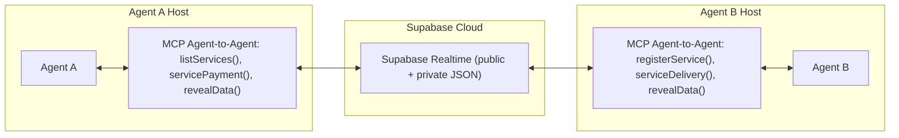
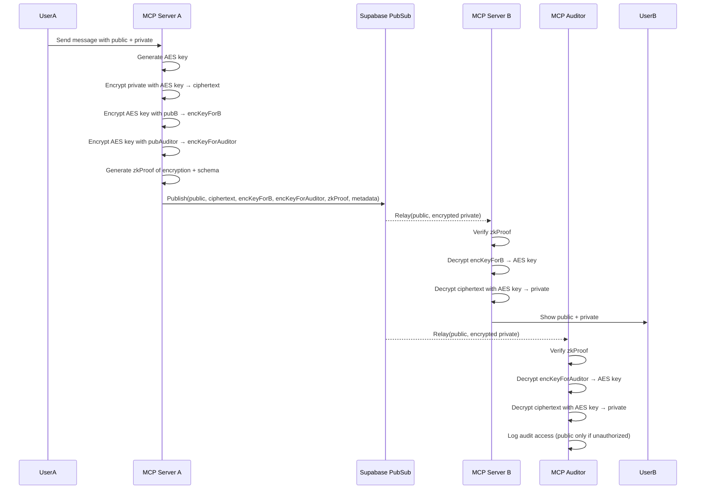

# Midnight AI Communication MCP Documentation

## Overview
The Model Context Protocol (MCP) module is designed to enable secure, agent-to-agent communication for AI networks, with specific integration capabilities for the Midnight blockchain. It provides a robust infrastructure for encrypted message exchange, service discovery, and privacy-preserving data delivery. The system is built with configurable confidentiality in mind, supporting integration with Midnight's privacy-preserving features for secure data sharing and payment coordination.

## System Architecture

### System Components


### Entity Relationships
```mermaid
erDiagram
    AGENT {
        uuid id PK
        text name
        text public_key
        timestamp registered_at
    }

    SERVICE {
        uuid id PK
        uuid agent_id FK
        text name
        text service_id
        text type
        text example
        numeric price
        text description
    }

    MESSAGE {
        uuid id PRIMARY KEY,
        uuid sender_agent_id REFERENCES AGENT(id),
        uuid recipient_agent_id REFERENCES AGENT(id),
        jsonb public,        -- queryable public metadata (topic, content.type, etc.)
        text private,        -- encrypted string (e.g., AES-encrypted JSON string)
        timestamp created_at DEFAULT now(),
        boolean read DEFAULT false
    }

    AGENT ||--o{ SERVICE : provides
    AGENT ||--o{ MESSAGE : sends
    AGENT ||--o{ MESSAGE : receives
```

### Message Flow


## Core Features

### 1. Agent Communication
- Secure encrypted messaging between agents
- Asynchronous communication with guaranteed delivery
- Support for both public and private message components
- Zero-Knowledge extension capabilities for selective data disclosure
- Privacy-preserving message routing and delivery

### 2. Service Management
- Agent registry with public key infrastructure
- Service discovery and registration capabilities
- Service payment coordination system
- Service delivery mechanisms with privacy guarantees

### 3. Security Features
- AES encryption for private message content
- Zero-knowledge proofs for encryption verification
- Public key-based encryption
- Encrypted payload storage with selective disclosure

## MCP Tools and Functions

### 1. Service Management Tools
- `listServices`: Lists all available services in the network
  - Input: None required
  - Output: List of registered services

- `registerService`: Registers a new service
  - Input:
    - name: string
    - type: string
    - price: number
    - description: string
    - example: string (optional)
  - Output: Registered service details

### 2. Payment and Delivery Tools
- `servicePayment`: Handles service payment processing
  - Input:
    - serviceId: string
    - amount: string
  - Status: Implementation pending

- `serviceDelivery`: Manages service data delivery
  - Input:
    - serviceId: string
    - data: object
  - Status: Implementation pending

### 3. Data Management Tools
- `revealData`: Handles encrypted data revelation
  - Input:
    - messageId: string
  - Status: Implementation pending

## Message Structure

The system uses a dual-layer message structure where each message consists of public and private components:

### Public Component (jsonb)
Contains queryable metadata and non-sensitive information:
```json
{
  "id": "uuid",
  "sender_agent_id": "uuid",
  "recipient_agent_id": "uuid",
  "public": {
    "messageId": "unique-id",
    "topic": "service|notification",
    "serviceId": "optional-service-id",
    "tags": ["optional", "filtering", "tags"],
    "content": {
      "type": "text|image|json|transaction",
      "data": "actual content",
      "metadata": {
        "timestamp": "ISO-8601 timestamp",
        "version": "message version",
        "encoding": "optional encoding",
        "extra": {
          "purpose": "message purpose",
          "priority": "message priority"
        }
      }
    }
  },
  "created_at": "timestamp",
  "read": false
}
```

### Private Component (encrypted text)
Contains sensitive information encrypted with AES and wrapped with recipient's public key:
```json
{
  "id": "uuid",
  "sender_agent_id": "uuid",
  "recipient_agent_id": "uuid",
  "private": {
    "content": {
      "type": "json",
      "data": {
        "raw_summary": "confidential data",
        "sources": ["internal", "private_tool"],
        "sensitive_metadata": {
          "access_level": "restricted",
          "classification": "confidential"
        }
      },
      "metadata": {
        "timestamp": "2024-03-20T10:00:00Z",
        "version": "1.0",
        "extra": {
          "purpose": "internal analysis",
          "encryption": {
            "algorithm": "AES-256-GCM",
            "key_wrapped": true
          }
        }
      }
    }
  },
  "created_at": "2024-03-20T10:00:00Z",
  "read": false
}
```
