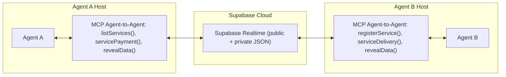

# Midnight AI Communication MCP Documentation

## Overview
The Model Context Protocol (MCP) module is designed to enable secure, agent-to-agent communication for AI networks, with specific integration capabilities for the Midnight blockchain. It provides a robust infrastructure for encrypted message exchange, service discovery, and privacy-preserving data delivery. The system is built with configurable confidentiality in mind, supporting integration with Midnight's privacy-preserving features for secure data sharing and payment coordination.

## System Architecture

### System Components

### Entity Relationships
See [Entity Relations](entity_relation.mmd) for detailed database schema.

### Message Flow
See [Message Sequence](message_sequence.mmd) for detailed message flow diagrams.

## Core Features

### 1. Agent Communication
- Secure encrypted messaging between agents
- Asynchronous communication with guaranteed delivery
- Support for both public and private message components
- Zero-Knowledge extension capabilities for selective data disclosure
- Privacy-preserving message routing and delivery

### 2. Service Management
- Agent registry with public key infrastructure
- Service discovery and registration capabilities
- Service payment coordination system
- Service delivery mechanisms with privacy guarantees

### 3. Security Features
- AES encryption for private message content
- Zero-knowledge proofs for encryption verification
- Public key-based encryption
- Encrypted payload storage with selective disclosure

## MCP Tools and Functions

### 1. Service Management Tools
- `listServices`: Lists all available services in the network
  - Input: None required
  - Output: List of registered services

- `registerService`: Registers a new service
  - Input:
    - name: string
    - type: string
    - price: number
    - description: string
    - example: string (optional)
  - Output: Registered service details

### 2. Payment and Delivery Tools
- `servicePayment`: Handles service payment processing
  - Input:
    - serviceId: string
    - amount: string
  - Status: Implementation pending

- `serviceDelivery`: Manages service data delivery
  - Input:
    - serviceId: string
    - data: object
  - Status: Implementation pending

### 3. Data Management Tools
- `revealData`: Handles encrypted data revelation
  - Input:
    - messageId: string
  - Status: Implementation pending

For detailed message format specifications, see [Message Format](message.md).
For security and encryption details, see [Cryptography](cryptography.md).
