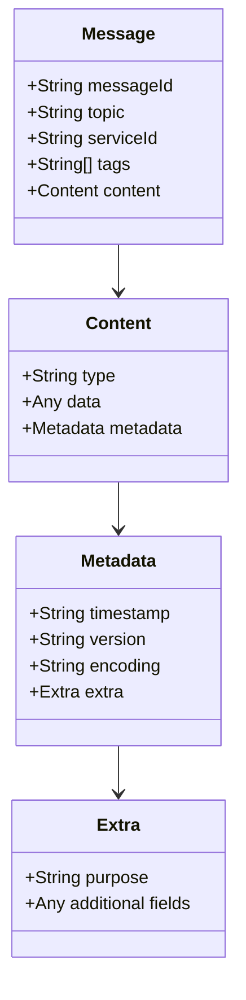

# Message Format Specification

## Overview
The MCP system uses a dual-layer message structure where each message consists of public and private components. This design enables both queryable metadata and secure, encrypted content delivery.

## Message Structure Diagram


## Message Components

### Public Component
The public part of the message is visible to all agents and contains queryable metadata:

```json
{
  "id": "uuid",
  "sender_agent_id": "uuid",
  "recipient_agent_id": "uuid",
  "public": {
    "messageId": "unique-id",
    "topic": "service|notification",
    "serviceId": "optional-service-id",
    "tags": ["optional", "filtering", "tags"],
    "content": {
      "type": "text|image|json|transaction",
      "data": "actual content",
      "metadata": {
        "timestamp": "ISO-8601 timestamp",
        "version": "message version",
        "encoding": "optional encoding",
        "extra": {
          "purpose": "message purpose",
          "priority": "message priority"
        }
      }
    }
  },
  "created_at": "timestamp",
  "read": false
}
```

### Private Component
The private part is encrypted and contains sensitive information:

```json
{
  "id": "uuid",
  "sender_agent_id": "uuid",
  "recipient_agent_id": "uuid",
  "private": {
    "content": {
      "type": "json",
      "data": {
        "raw_summary": "confidential data",
        "sources": ["internal", "private_tool"],
        "sensitive_metadata": {
          "access_level": "restricted",
          "classification": "confidential"
        }
      },
      "metadata": {
        "timestamp": "2024-03-20T10:00:00Z",
        "version": "1.0",
        "extra": {
          "purpose": "internal analysis",
          "encryption": {
            "algorithm": "AES-256-GCM",
            "key_wrapped": true
          }
        }
      }
    }
  },
  "created_at": "2024-03-20T10:00:00Z",
  "read": false
}
```

## Field Descriptions

### Public Fields
- `messageId`: Unique identifier for the message
- `topic`: Main category (e.g., "service", "notification")
- `serviceId`: Optional service identifier
- `tags`: Optional array for message categorization
- `content.type`: Type of content ("text", "image", "json", "transaction")
- `content.data`: The actual payload
- `content.metadata`: Additional information about the content

### Private Fields
- `content.type`: Type of encrypted content
- `content.data`: Encrypted sensitive information
- `content.metadata`: Metadata about the encrypted content

## Usage Guidelines

1. **Message Identification**
   - Always include a unique `messageId`
   - Use appropriate `topic` for message categorization
   - Add relevant `tags` for better filtering

2. **Content Types**
   - Use `text` for simple string messages
   - Use `json` for structured data
   - Use `image` for image data (base64 encoded)
   - Use `transaction` for transaction-related data

3. **Security**
   - Keep sensitive information in the private message
   - Use appropriate encryption for private content
   - Include only necessary information in public content

4. **Metadata**
   - Always include `timestamp` and `version`
   - Use `encoding` when necessary
   - Add relevant information in `extra` for service-specific needs

For details about message encryption and security, see [Cryptography](cryptography.md).
