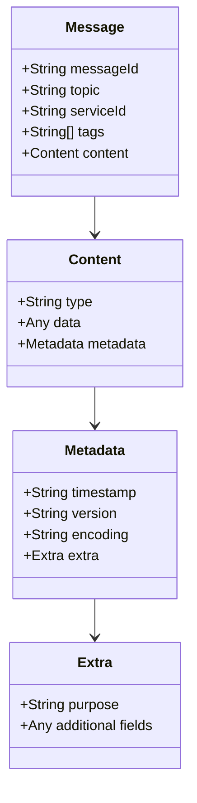

# message.public
{
  "messageId": "7e0cb182-a845-47e0-8ad6-671f94521b62",
  "topic": "service",                        // "service", "notification", etc.
  "serviceId": "svc-1234",                   // Optional
  "tags": ["summary", "delivery"],           // Optional, for filtering
  "content": {
    "type": "text",                          // "text", "image", "json", "transaction", etc.
    "data": "This is a summary for you",
    "metadata": {
      "timestamp": "2024-03-20T10:00:00Z",
      "version": "1.0",
      "encoding": "utf-8",                   // Optional
      "extra": {
        "purpose": "delivery",
        "priority": "high"
      }
    }
  }
}

# message.private Stored as an encrypted string
{
  "content": {
    "type": "json",                          // Can also be "text", "image", "binary"
    "data": {
      "raw_summary": "confidential data",
      "sources": ["internal", "private_tool"]
    },
    "metadata": {
      "timestamp": "2024-03-20T10:00:00Z",
      "version": "1.0",
      "extra": {
        "purpose": "internal analysis"
      }
    }
  }
}

# Message Format Documentation

## Overview
The message format is designed to be flexible and extensible, supporting various types of communications between agents. Each message consists of two main parts: public and private data.

## Structure Diagram


## Message Components

### Public Message
The public part of the message is visible to all agents and contains:
- `messageId`: Unique identifier for the message
- `topic`: Main category (e.g., "service", "notification")
- `serviceId`: Optional service identifier
- `tags`: Optional array for message categorization
- `content`: The main payload

### Private Message
The private part is encrypted and contains sensitive information:
- `content`: Encrypted payload with the same structure as public content

### Content Structure
Both public and private messages use the same content structure:
- `type`: Content type ("text", "image", "json", "transaction", etc.)
- `data`: The actual payload
- `metadata`: Additional information about the content

### Metadata
- `timestamp`: Creation time
- `version`: Message format version
- `encoding`: Data encoding (optional)
- `extra`: Service-specific metadata

## Examples

### Public Message Example
```json
{
  "messageId": "7e0cb182-a845-47e0-8ad6-671f94521b62",
  "topic": "service",
  "serviceId": "svc-1234",
  "tags": ["summary", "delivery"],
  "content": {
    "type": "text",
    "data": "This is a summary for you",
    "metadata": {
      "timestamp": "2024-03-20T10:00:00Z",
      "version": "1.0",
      "encoding": "utf-8",
      "extra": {
        "purpose": "delivery",
        "priority": "high"
      }
    }
  }
}
```

### Private Message Example
```json
{
  "content": {
    "type": "json",
    "data": {
      "raw_summary": "confidential data",
      "sources": ["internal", "private_tool"]
    },
    "metadata": {
      "timestamp": "2024-03-20T10:00:00Z",
      "version": "1.0",
      "extra": {
        "purpose": "internal analysis"
      }
    }
  }
}
```

## Usage Guidelines

1. **Message Identification**
   - Always include a unique `messageId`
   - Use appropriate `topic` for message categorization
   - Add relevant `tags` for better filtering

2. **Content Types**
   - Use `text` for simple string messages
   - Use `json` for structured data
   - Use `image` for image data (base64 encoded)
   - Use `transaction` for transaction-related data

3. **Security**
   - Keep sensitive information in the private message
   - Use appropriate encryption for private content
   - Include only necessary information in public content

4. **Metadata**
   - Always include `timestamp` and `version`
   - Use `encoding` when necessary
   - Add relevant information in `extra` for service-specific needs
