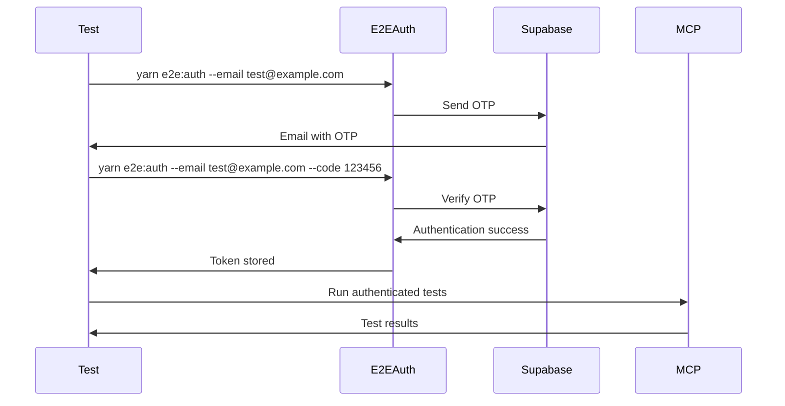

# Testing Documentation

This directory contains comprehensive documentation for testing the Agent Communication MCP project, including unit tests, integration tests, and end-to-end testing strategies.

## Testing Overview

The project uses a multi-layered testing approach:

1. **Unit Tests**: Test individual components in isolation
2. **Integration Tests**: Test component interactions
3. **End-to-End Tests**: Test complete workflows including authentication
4. **Authentication Testing**: Automated token management for E2E tests

## Test Structure

### Core Test Files

- **`test/`** - Main test directory containing all test files
- **`test/README.md`** - Detailed test suite documentation
- **`scripts/e2e-auth.ts`** - Authentication script for E2E testing

### Authentication for Testing

The project requires authentication for most operations. The `e2e-auth` script provides automated token management:

#### Quick Start

```bash
# 1. Send OTP to your email
yarn e2e:auth --email your-email@example.com

# 2. Check your email for the OTP code (e.g., 123456)

# 3. Verify the OTP
yarn e2e:auth --email your-email@example.com --code 123456

# 4. Verify token is stored
yarn e2e:auth --status
```

#### Automated Testing

For automated testing scenarios:

```bash
# Load existing token (for CI/CD)
yarn e2e:auth --load

# Refresh token if needed
yarn e2e:auth --refresh

# Check token status
yarn e2e:auth --status
```

## Testing Categories

### 1. Unit Tests

Unit tests focus on individual components and functions:

- **`test/resources.test.ts`** - MCP resource definitions and handlers
- **`test/prompt.test.ts`** - Prompt management system
- **`test/validation-service.test.ts`** - Input validation logic
- **`test/encryption.test.ts`** - Cryptographic operations
- **`test/wallet-service.test.ts`** - Wallet-related utilities

### 2. Integration Tests

Integration tests verify component interactions:

- **`test/supabase/message-types.test.ts`** - Database integration
- **`test/utils/key-manager.integration.test.ts`** - Key management
- **`test/utils/file-manager.test.ts`** - File system operations

### 3. End-to-End Tests

E2E tests require authentication and test complete workflows:

- **Authentication Setup**: Use `e2e-auth` script for token management
- **Service Registration**: Test complete service lifecycle
- **Message Exchange**: Test encrypted communication
- **Payment Processing**: Test payment workflows

## Authentication Testing Strategy

### Why Authentication is Required

The MCP system requires authentication for security reasons:

1. **Service Registration**: All marketplace operations require authentication
2. **Data Privacy**: Encrypted communication requires authenticated sessions
3. **Access Control**: Prevents unauthorized access to agent services
4. **Audit Trail**: All operations are tied to authenticated users

### Authentication Flow for Testing



### Token Management

The `e2e-auth` script handles:

- **Token Creation**: OTP-based authentication
- **Token Storage**: Secure file-based storage
- **Token Validation**: Expiration and validity checks
- **Token Refresh**: Automatic renewal before expiration
- **Token Cleanup**: Secure deletion

## Running Tests

### Prerequisites

1. **Environment Setup**: Ensure all environment variables are configured
2. **Authentication**: Complete authentication setup using `e2e-auth`
3. **Dependencies**: Install all required packages

### Test Commands

```bash
# Run all tests
yarn test

# Run tests in watch mode
yarn test:watch

# Run tests with coverage
yarn test:coverage

# Run specific test file
yarn test:file test/resources.test.ts

# Setup authentication for E2E tests
yarn e2e:auth --load
```

### Test Environment Variables

Required environment variables for testing:

```bash
# Supabase Configuration
SUPABASE_URL=https://your-project.supabase.co
SUPABASE_ANON_KEY=your-anon-key

# Agent Configuration
AGENT_ID=test-agent

# Wallet MCP Configuration
WALLET_MCP_URL=localhost:3000

# Logging
LOG_LEVEL=info
```

## CI/CD Integration

### GitHub Actions Example

```yaml
name: Tests
on: [push, pull_request]

jobs:
  test:
    runs-on: ubuntu-latest
    steps:
      - uses: actions/checkout@v3
      - uses: actions/setup-node@v3
        with:
          node-version: '18'
      
      - name: Install dependencies
        run: yarn install
      
      - name: Setup authentication
        run: |
          yarn e2e:auth --email ${{ secrets.TEST_EMAIL }} --code ${{ secrets.TEST_OTP }}
        env:
          SUPABASE_URL: ${{ secrets.SUPABASE_URL }}
          SUPABASE_ANON_KEY: ${{ secrets.SUPABASE_ANON_KEY }}
          AGENT_ID: ${{ secrets.AGENT_ID }}
      
      - name: Run tests
        run: yarn test
        env:
          SUPABASE_URL: ${{ secrets.SUPABASE_URL }}
          SUPABASE_ANON_KEY: ${{ secrets.SUPABASE_ANON_KEY }}
          AGENT_ID: ${{ secrets.AGENT_ID }}
```

## Test Data Management

### Test Data Isolation

- Each test should use unique identifiers
- Clean up test data after tests complete
- Use agent-specific storage directories
- Avoid conflicts between parallel test runs

### Mock Data

For unit tests, use mock data:

```typescript
const mockService = {
  id: 'test-service-123',
  name: 'Test Service',
  type: 'data-processing',
  price: '0.001',
  description: 'Test service for unit testing'
};
```

## Security Testing

### Authentication Security

- Test token expiration handling
- Verify secure token storage
- Test refresh token logic
- Validate access control

### Encryption Testing

- Test key generation and storage
- Verify message encryption/decryption
- Test key rotation scenarios
- Validate cryptographic operations

## Performance Testing

### Load Testing

- Test concurrent authentication requests
- Verify token refresh performance
- Test message processing under load
- Monitor memory usage during tests

### Benchmarking

- Measure authentication response times
- Test token validation performance
- Benchmark encryption operations
- Monitor database query performance

## Troubleshooting

### Common Test Issues

1. **Authentication Failures**
   - Check environment variables
   - Verify Supabase configuration
   - Ensure OTP codes are valid

2. **Token Expiration**
   - Use `yarn e2e:auth --refresh`
   - Re-authenticate if needed
   - Check token status with `yarn e2e:auth --status`

3. **Test Timeouts**
   - Increase Jest timeout for slow operations
   - Check network connectivity
   - Verify Supabase service status

### Debug Mode

Enable debug logging for troubleshooting:

```bash
LOG_LEVEL=debug yarn test
```

## Best Practices

### Test Organization

1. **Group Related Tests**: Use describe blocks for logical grouping
2. **Clear Test Names**: Use descriptive test names
3. **Setup and Teardown**: Use beforeEach/afterEach for cleanup
4. **Isolation**: Ensure tests don't depend on each other

### Authentication Best Practices

1. **Token Management**: Always use the `e2e-auth` script
2. **Secure Storage**: Never commit tokens to version control
3. **Regular Refresh**: Refresh tokens before they expire
4. **Error Handling**: Handle authentication failures gracefully

### Test Data Management

1. **Unique Identifiers**: Use unique IDs for each test
2. **Cleanup**: Always clean up test data
3. **Isolation**: Use separate storage for each test run
4. **Validation**: Verify test data integrity

## Related Documentation

- [E2E Authentication Script](e2e-authentication.md) - Detailed authentication script documentation
- [System Design](../system-design.md) - Overall system architecture
- [Project Overview](../project-overview.md) - Project context and features
- [Test Suite README](../../test/README.md) - Detailed test file documentation
